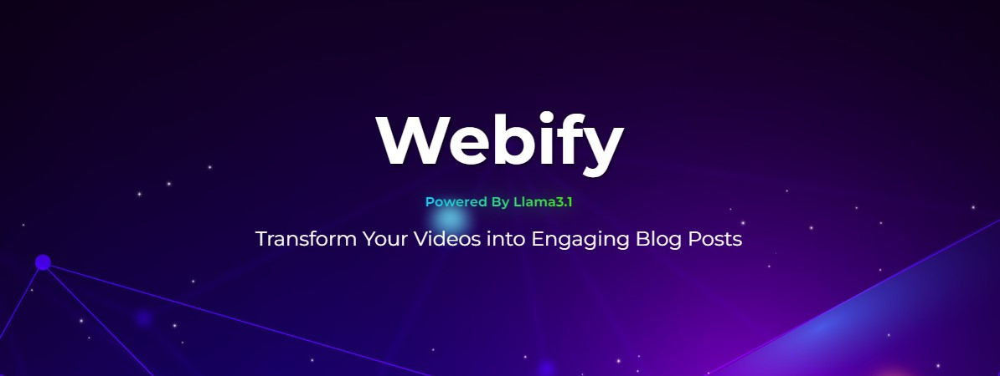

# Webify

Webify is a tool designed to effortlessly convert YouTube videos into fully functional websites. This project leverages Flask and LangChain to extract and parse content from YouTube videos, such as transcripts, thumbnails, and metadata, and generates a responsive, SEO-friendly website. Whether you're a content creator looking to repurpose your videos or someone who wants to quickly build a web presence, Webify makes it simple.


## Features
- **Automatic Transcription**: Uses LangChain to convert video speech into text, which can be used as content for the website.
- **Customizable Templates**: Choose from a variety of pre-designed templates to match your brand.
- **SEO Optimization**: Automatically includes meta tags, descriptions, and keywords to improve search engine rankings.
- **Live HTML Editor**: Edit your website's content and design in real-time with an integrated live HTML editor.
- **Responsive Design**: Generated websites are mobile-friendly and adaptable to different screen sizes.
- **Video Embedding**: Automatically embeds the YouTube video into the website, allowing visitors to watch directly from the site.
- **Metadata Extraction & Parsing**: Uses LangChain to extract and parse video metadata like title, description, and tags to populate the website content.
- **Easily Downloadable**: The generated website is packaged into a zip file for easy downloading.
- **Powered by Llama 3.1**: Utilizes the powerful Llama 3.1 model for advanced language processing and content generation.
## Getting Started

### Prerequisites

- **Python 3.8+**
- **YouTube Data API Key**: To fetch video data and transcripts.
- **Flask**: For running the web server.
- **LangChain**: For extracting, processing, and parsing information from YouTube videos.
- **LlamaIndex**: For embedding the large contents to the LLama model.
- **Bootstrap or TailwindCSS**: For front-end styling (optional but recommended).

### Installation

1. Clone the repository:
   ```bash
   git clone https://github.com/yourusername/webify.git
   cd webify
   ```

2. Install the required dependencies:
   ```bash
   pip install -r requirements.txt
   ```

3. Set up your environment variables:
   ```bash
   export TOGETHER_LLM_API_KEY='your_together_ai_api_key'
   ```

4. Run the application:
   ```bash
   python app.py
   ```

### Usage

1. Enter the URL of the YouTube video you want to convert into a website.
2. Select a template from the provided options.
3. Click "Generate Website".
4. Your website will be generated and saved in the `output` directory.

### Customization

- **Templates**: You can create your own HTML/CSS templates and place them in the `templates` directory. The template engine will use these to generate the website.
- **Styling**: Customize the appearance of your website by editing the CSS files in the `static/css` directory.

## Contributing

We welcome contributions! If you'd like to help improve Webify, please fork the repository and create a pull request with your changes. Whether it's fixing bugs, adding new features, or improving documentation, your contributions are appreciated.

## License

This project is licensed under the MIT License. See the [LICENSE](LICENSE) file for details.

## Contact

If you have any questions or suggestions, feel free to reach out:

- **Email**: prakrititz.borah@iiitb.ac.in
- **GitHub**: [Prakrititz Borah](https://github.com/SweetBunny123

---

This version reflects the use of LangChain for both information extraction and output parsing in the Webify project.
